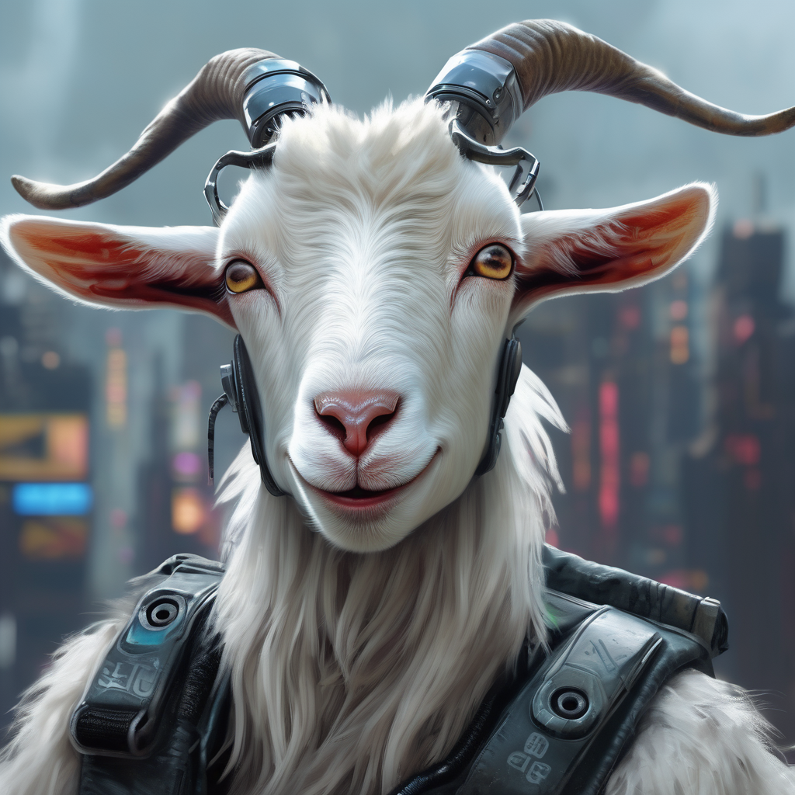

# Goat

Simply the world's greatest Discord bot!

## Setup

Poetry is used for dependency management. You can install it with pipx:

    pipx install poetry

Then, install the dependencies:

    poetry install

Then to run:

    poetry run start

You will need to register an application on Discord:
https://discordpy.readthedocs.io/en/stable/discord.html

You will need an OpenAI API key. You can request your own which will come with plenty of quota for development. I may also be able to add you to my project.

## Contributing

Please run pre-commit install to install standard pre-commit hooks.

## Cost management
The OpenAI queries are billed on a per-token basis. Token count per English request can be estimated by dividing the length by four. The Davinci engine is $0.02/1k tokens.
